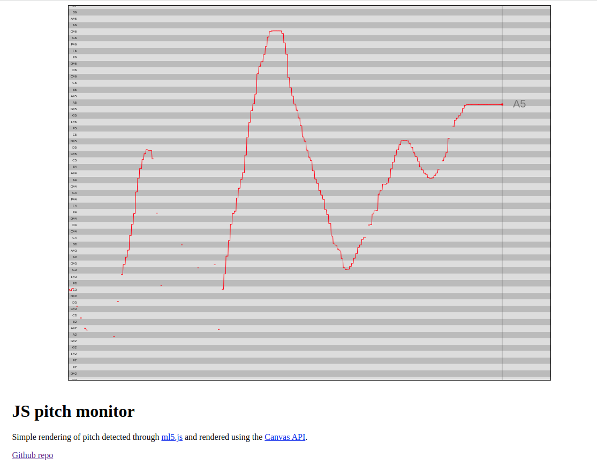

# Pitch Detector

[[Live page](//fghibellini.com/pitch-detector/)]

- currently uses: https://ml5js.org/reference/api-PitchDetection/

## Dependencies & Licenses

- [ml5](https://github.com/ml5js/ml5-library) for machine learning  - [MIT license](https://github.com/ml5js/ml5-library/blob/main/LICENSE)
- models from [ml5-data-and-models](https://github.com/ml5js/ml5-data-and-models/tree/master) - [MIT license](https://github.com/ml5js/ml5-data-and-models/blob/master/LICENSE)

## To explore

- https://github.com/peterkhayes/pitchfinder
